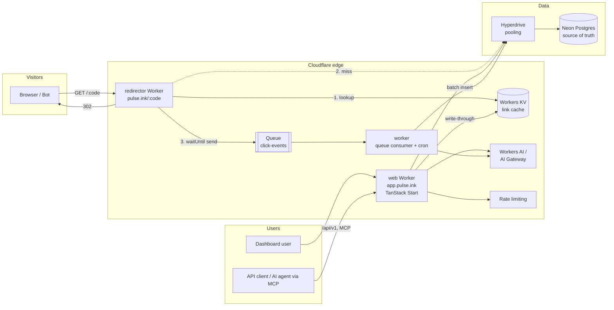
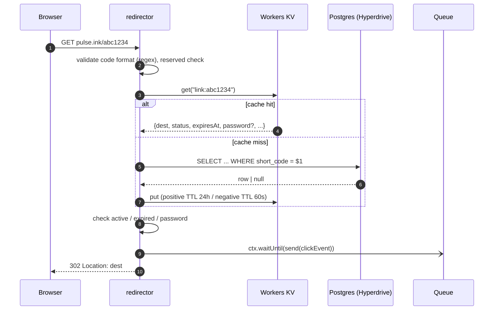
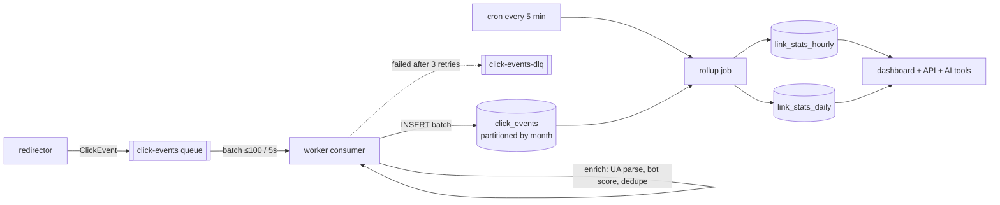
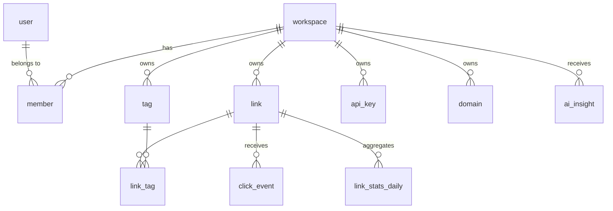
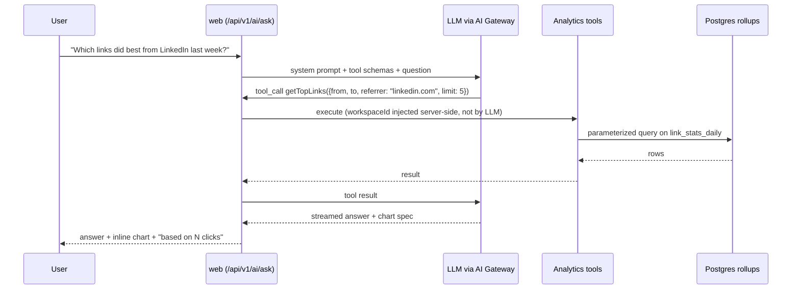
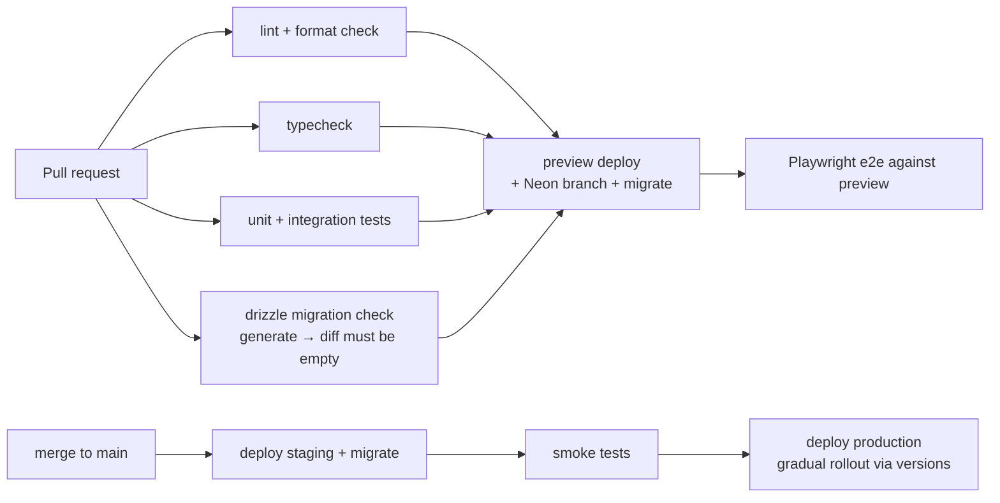

# Pulse — Architecture (v1)

> **Pulse** is an intelligent link management platform: short links, a globally fast redirect edge, a real click-analytics pipeline, and an AI layer that turns traffic data into answers.

| Field        | Value                                                       |
| ------------ | ----------------------------------------------------------- |
| Status       | **Draft** — decisions marked `PROPOSED` are open for review |
| Owner        | Sameer Ali ([@devxsameer](https://github.com/devxsameer))   |
| Last updated | 2026-10-08                                                  |
| Scope        | v1 (first public, production release)                       |

---

## Table of contents

1. [Goals & non-goals](#1-goals--non-goals)
2. [Product scope for v1](#2-product-scope-for-v1)
3. [Current state of the repo](#3-current-state-of-the-repo)
4. [System overview](#4-system-overview)
5. [Tech stack](#5-tech-stack)
6. [Repository layout](#6-repository-layout)
7. [The redirect hot path](#7-the-redirect-hot-path)
8. [Click analytics pipeline](#8-click-analytics-pipeline)
9. [Data model](#9-data-model)
10. [Short code design](#10-short-code-design)
11. [Caching & consistency](#11-caching--consistency)
12. [Auth, workspaces & authorization](#12-auth-workspaces--authorization)
13. [Public API & API keys](#13-public-api--api-keys)
14. [AI layer](#14-ai-layer)
15. [Security & abuse prevention](#15-security--abuse-prevention)
16. [Privacy](#16-privacy)
17. [Observability](#17-observability)
18. [Testing strategy](#18-testing-strategy)
19. [CI/CD & environments](#19-cicd--environments)
20. [Performance budgets & SLOs](#20-performance-budgets--slos)
21. [Cost model](#21-cost-model)
22. [Decision log](#22-decision-log)
23. [Roadmap & milestones](#23-roadmap--milestones)
24. [Portfolio angle](#24-portfolio-angle)

---

## 1. Goals & non-goals

### Goals

- **Fast redirects everywhere.** Redirects run at the edge, under 50 ms p95 server time on a cache hit, and they never wait on analytics writes.
- **Correct, trustworthy analytics.** Every click is captured asynchronously, bots are filtered, events are deduplicated, and the data is rolled up for fast dashboards.
- **AI that is grounded, not decorative.** AI features answer questions using real, typed analytics queries. They never invent numbers.
- **Production discipline.** Migrations, tests, CI/CD, observability, rate limiting, abuse prevention, and documented decisions.
- **Low cost.** The whole system runs on free or near-free tiers at hobby scale (Cloudflare + Neon).

### Non-goals (v1)

- Custom domains per workspace (planned for v1.1, but the data model accounts for it now).
- Billing / paid plans (the schema leaves room for it; no Stripe in v1).
- Team collaboration UI beyond a single owner per workspace (the schema is multi-tenant from day one).
- Native mobile apps, browser extension.
- Link-in-bio pages, A/B testing, geo/device targeting (v1.x).

---

## 2. Product scope for v1

### Core (must ship)

| Area        | Features                                                                                             |
| ----------- | ---------------------------------------------------------------------------------------------------- |
| Links       | Create / edit / archive / delete, custom alias, auto-generated code, expiration, enable/disable      |
| Link extras | Tags, UTM builder, QR code (SVG/PNG download), auto-fetched title + favicon + OG image               |
| Redirects   | Edge redirect, 302 by default, expired / disabled / not-found pages, password-protected links        |
| Analytics   | Clicks over time, unique visitors, top referrers, countries, cities, devices, browsers, OS           |
| Auth        | Email + password (with verification), GitHub OAuth, sessions, password reset                         |
| API         | REST API with API keys, OpenAPI spec, rate limits                                                    |
| AI          | Ask Pulse (natural-language analytics), weekly AI insights, AI slug/metadata suggestions, URL safety |

### Stretch for v1 (ship if time allows)

- **Pulse MCP server**, so Claude, Cursor, and other AI agents can create links and query analytics. This is a strong "AI era" differentiator.
- Bulk link import from CSV.
- Webhooks for `link.clicked` (sampled) and `link.created`.

---

## 3. Current state of the repo

What exists today:

- Turborepo + pnpm monorepo with `apps/web` and shared `typescript-config` / `eslint-config` packages.
- `apps/web`: TanStack Start (React 19, SSR) deployed to **Cloudflare Workers** (`pulse-web`) via `@cloudflare/vite-plugin`.
- Neon Postgres via `drizzle-orm/neon-http`; Drizzle migrations in `apps/web/drizzle`. The DB client, Better Auth instance, and validated server env (`src/lib/env.ts`) are all created lazily on first use.
- Self-hosted Better Auth (email/password + GitHub OAuth) with the `organization` plugin. Every user gets a personal workspace, which becomes the session's active workspace.
- `links` owned by `workspace_id` (with `created_by` for the author). Short codes are case-insensitively unique, reserved words are blocked, and inserts catch unique violations instead of checking first.
- Link management (M1): create, edit, disable/enable, and soft delete; `ILIKE` search and cursor pagination with Load more; per-link QR dialog (PNG/SVG, in the browser); title/description/favicon prefill on paste through an SSRF-guarded, rate-limited server fetch. Layering is server function → service (typed errors, `LinkView` mapper) → repository (workspace-scoped, `deleted_at IS NULL`).
- A `/r/$shortCode` route that does a 302 by querying Postgres directly, with static 404/410 status pages for not-found, disabled, and expired links. It gets replaced by the edge redirector in M2.
- Dashboard UI shell (shadcn) with placeholder analytics and AI insight cards.
- Vitest unit tests for link logic (short codes, normalization, SSRF guard, metadata parser, status pages), and GitHub Actions CI running lint, typecheck, tests, a migration-sync check, and build.
- Accepted decisions are recorded in [`docs/adr/`](adr/README.md).

---

## 4. System overview

Pulse is split into **three deployable units** that share code through packages:

1. **`redirector`** is a tiny Cloudflare Worker on the short domain (e.g. `pulse.ink`). It does exactly one thing: resolve a code to a destination and redirect, as fast as possible.
2. **`web`** is the TanStack Start app on the app domain (e.g. `app.pulse.ink`). It hosts the dashboard, marketing site, auth, server functions, and the public REST API under `/api/v1`.
3. **`worker`** is a background Worker. It consumes the click queue, runs cron jobs (rollups, AI insights, cleanup), and does async jobs such as metadata fetching and safety scans.



**Why split `redirector` from `web`?**

- **Blast radius.** A bad dashboard deploy can't break every short link on the internet.
- **Cold start and bundle size.** The redirector bundle is a few KB. The SSR app bundle is MBs.
- **Independent scaling and limits.** The two have different rate limits, caching, and observability.
- **Interview story.** It shows a clear read path vs. write path separation (CQRS-lite).

---

## 5. Tech stack

| Layer             | Choice                                                    | Why                                                                                    |
| ----------------- | --------------------------------------------------------- | -------------------------------------------------------------------------------------- |
| Monorepo          | pnpm + Turborepo                                          | Already set up; cached builds; shared packages                                         |
| App framework     | TanStack Start (React 19, SSR)                            | Already in use; type-safe routing + server functions                                   |
| UI                | Tailwind v4 + shadcn/ui + Recharts                        | Already in use; charts for analytics                                                   |
| Data fetching     | TanStack Query                                            | Already in use                                                                         |
| Forms             | TanStack Form + Zod                                       | Already in use                                                                         |
| Runtime           | Cloudflare Workers                                        | Global edge, cheap, no servers to manage                                               |
| Database          | Neon Postgres                                             | Serverless Postgres, branching for previews                                            |
| DB access         | Drizzle ORM + **Hyperdrive** (`postgres` driver)          | Connection pooling + query caching from Workers; the HTTP driver is fine as a fallback |
| Edge cache        | Workers KV                                                | Global, cheap reads for code → destination                                             |
| Async             | Cloudflare Queues                                         | Decouple click capture from redirect latency; batching; retries; DLQ                   |
| Scheduled jobs    | Cron Triggers                                             | Rollups, insights, cleanup                                                             |
| Auth              | Better Auth (+ `organization`, `apiKey` plugins)          | Already in use; workspaces and API keys without custom code                            |
| AI                | AI SDK (`ai`) via Cloudflare AI Gateway                   | Provider-agnostic, tool calling, caching, logging, rate limits through the gateway     |
| Email             | Resend                                                    | Verification, password reset, weekly insights                                          |
| Validation        | Zod v4                                                    | Shared between client, server, API, and OpenAPI generation                             |
| API docs          | OpenAPI 3.1 (generated from Zod) + Scalar UI              | Real public API docs                                                                   |
| Errors / tracing  | Sentry (`@sentry/cloudflare`) + Workers Logs              | Errors, performance, release tracking                                                  |
| Product analytics | PostHog (optional)                                        | Funnels for the product itself                                                         |
| Testing           | Vitest, `@cloudflare/vitest-pool-workers`, Playwright, k6 | Unit, integration in the real runtime, e2e, load                                       |
| CI/CD             | GitHub Actions + Wrangler                                 | Preview deploys per PR with Neon branches                                              |

---

## 6. Repository layout

Target layout. Packages are extracted only when a second app needs them (M2); until then the code lives in `apps/web` (`src/db`, `src/features/*/lib`):

```
pulse/
├── apps/
│   ├── web/                    # TanStack Start: dashboard, marketing, auth, /api/v1, MCP
│   │   └── src/
│   │       ├── routes/         # file routes (thin: parse → call service → render)
│   │       ├── features/       # feature modules: links, analytics, ai, auth, workspaces, api-keys
│   │       │   └── <feature>/
│   │       │       ├── client/     # queries, mutations, hooks
│   │       │       ├── components/
│   │       │       ├── pages/
│   │       │       ├── schemas/    # zod (re-exported from @pulse/core where shared)
│   │       │       └── server/     # *.functions.ts (server fns), *.service.ts, *.repository.ts
│   │       ├── components/ui/  # shadcn
│   │       └── lib/
│   ├── redirector/             # edge redirect Worker (no framework, just fetch handler)
│   └── worker/                 # queue consumer + cron + async jobs
├── packages/
│   ├── db/                     # drizzle schema, migrations, client factory, repositories
│   ├── core/                   # pure domain logic: short codes, URL normalization, UA parsing, bot detection, zod schemas
│   ├── ai/                     # prompts, tools (typed analytics queries), model config
│   ├── analytics/              # query builders for rollups / time series
│   ├── email/                  # React Email templates
│   ├── typescript-config/
│   └── eslint-config/
├── docs/
│   ├── ARCHITECTURE.md         # this file
│   └── adr/                    # one file per accepted decision (0001-*.md)
└── .github/workflows/
```

**Layering rule (inside every feature):**

```
route / server fn / API handler   →  validates input (zod), resolves auth context
        ↓
service                           →  business rules, authorization, orchestration
        ↓
repository                        →  SQL only (drizzle); no business rules
```

Services never import from `routes`, and repositories never import from services. `packages/core` has **no** I/O, so it is trivially unit-testable.

---

## 7. The redirect hot path

This is the most important code in the system. It must be **fast, correct, and never blocked by analytics.**



### Rules

- **Code validation first.** Reject anything that doesn't match `^[A-Za-z0-9_-]{1,64}$` before touching KV, so junk traffic stays cheap.
- **Cached value shape** (kept small and versioned):

  ```ts
  type CachedLink = {
    v: 1;
    id: string;
    workspaceId: string;
    url: string;
    status: "active" | "disabled";
    expiresAt: number | null; // epoch ms
    passwordHash: string | null;
    redirectType: 301 | 302 | 307 | 308;
  };
  ```

- **Negative caching.** Cache "not found" for 60 s to absorb scanners and typo storms.
- **Status codes.** Default to **302**, because 301s get cached by browsers forever and kill analytics accuracy. Allow 301/307/308 per link.
- **Response headers.** Set `Cache-Control: private, no-store` (needed for analytics correctness), `Referrer-Policy: unsafe-url` only when the link opts into referrer passthrough, and `X-Robots-Tag: noindex`.
- **Error pages.** Expired, disabled, not-found, and password links render tiny static HTML pages from the redirector itself (no SSR app round-trip).
- **Password-protected links.** Show a form; on POST, verify against `passwordHash` and set a short-lived signed cookie scoped to that code.
- **Click capture is fire-and-forget.** `ctx.waitUntil(env.CLICKS.send(event))`. If the queue send fails, log it and still redirect, because availability beats analytics completeness.
- **Bots.** Social preview crawlers (Twitterbot, facebookexternalhit, Slackbot, Discordbot, LinkedInBot) still get redirected but are tagged `isBot=true`. They count in "previews" but not in "clicks".

---

## 8. Click analytics pipeline



### Event shape (produced by the redirector)

```ts
type ClickEvent = {
  v: 1;
  eventId: string; // uuidv7, used for idempotent inserts
  linkId: string;
  workspaceId: string;
  ts: number; // epoch ms
  // from request.cf (free, no lookup needed)
  country: string | null;
  region: string | null;
  city: string | null;
  continent: string | null;
  asn: number | null;
  // from headers
  referrer: string | null;
  userAgent: string | null;
  // privacy-preserving visitor id
  visitorHash: string; // sha256(ip + ua + daily_salt), rotated daily
  isBotHint: boolean; // cheap edge check; consumer re-evaluates
};
```

### Consumer responsibilities

1. **Parse the user agent** into device type, browser, and OS (`ua-parser-js` or a lightweight equivalent).
2. **Bot detection.** Combine a known-bot list, `request.cf.botManagement` if available, and ASN heuristics (datacenter ASNs).
3. **Normalize the referrer** to its domain (`t.co` → `twitter.com`, `l.facebook.com` → `facebook.com`), plus a `direct` bucket.
4. **Idempotent insert.** `INSERT ... ON CONFLICT (event_id) DO NOTHING`, because queues are at-least-once.
5. **Batching.** One multi-row insert per batch.

### Rollups

- A cron job every 5 minutes aggregates new events into `link_stats_hourly` and `link_stats_daily` using an upsert, with dimensions `(link_id, bucket, country, device, browser, os, referrer_domain)`.
- A watermark table (`rollup_state`) tracks the last processed `event_id` / `ts`, so rollups are incremental and safely re-runnable.
- Dashboards **only read rollups**, plus "last 5 minutes" from raw events for a live feel.

### Retention

- Raw `click_events` are kept for 90 days. Old monthly partitions are dropped by cron, which is O(1) and avoids slow `DELETE`s.
- Rollups are kept indefinitely.

> See [D3](#22-decision-log) for the alternative analytics store options (Workers Analytics Engine, ClickHouse/Tinybird).

---

## 9. Data model

All IDs are `uuid` (v7 where generated by the app, for index locality) unless noted. All timestamps are `timestamptz`.



### Tables

**Auth (managed by Better Auth):** `user`, `session` (with `active_organization_id`), `account`, `verification`, plus `organization`, `member`, and `invitation` from the organization plugin, and `apikey` later. Better Auth IDs are `text`.

**`organization`** (called a **workspace** in the product and in our own columns, e.g. `links.workspace_id`)

| column     | type        | notes                                 |
| ---------- | ----------- | ------------------------------------- |
| id         | text PK     |                                       |
| name       | text        |                                       |
| slug       | text unique | used in URLs: `/w/:slug/links`        |
| plan       | text        | `free` for v1; room for billing later |
| created_at | timestamptz |                                       |

**`domain`** (v1 has one row: the default short domain; custom domains in v1.1)

| column       | type        | notes                   |
| ------------ | ----------- | ----------------------- |
| id           | uuid PK     |                         |
| workspace_id | uuid FK     | null = platform default |
| hostname     | text unique | `pulse.ink`             |
| verified_at  | timestamptz |                         |

**`link`** (the target design; today's `links` table has `id`, `workspace_id`, `created_by`, `short_code`, `destination_url`, `title`, `description`, `favicon_url`, `image_url`, `is_active`, `expires_at`, `deleted_at`, `created_at`, `updated_at`. The remaining columns arrive with the milestones that need them)

| column                  | type        | notes                                                                                                                         |
| ----------------------- | ----------- | ----------------------------------------------------------------------------------------------------------------------------- |
| id                      | uuid PK     |                                                                                                                               |
| workspace_id            | uuid FK     | ownership                                                                                                                     |
| created_by              | text FK     | user id                                                                                                                       |
| domain_id               | uuid FK     |                                                                                                                               |
| short_code              | text        | **unique per (domain_id, short_code)**                                                                                        |
| destination_url         | text        | normalized                                                                                                                    |
| title                   | text        | fetched or user-provided                                                                                                      |
| description             | text        |                                                                                                                               |
| image_url               | text        | OG image                                                                                                                      |
| favicon_url             | text        |                                                                                                                               |
| utm\_\*                 | text ×5     | source, medium, campaign, term, content                                                                                       |
| password_hash           | text        | nullable                                                                                                                      |
| redirect_type           | smallint    | 302 default                                                                                                                   |
| status                  | enum        | `active`, `disabled`, `blocked` (blocked = flagged by safety)                                                                 |
| safety_status           | enum        | `pending`, `safe`, `suspicious`, `malicious`                                                                                  |
| expires_at              | timestamptz |                                                                                                                               |
| archived_at             | timestamptz | soft-archive (hidden from list, still redirects)                                                                              |
| deleted_at              | timestamptz | soft delete (stops redirecting; code stays reserved, no purge in v1, [ADR 0003](adr/0003-immutable-codes-and-soft-delete.md)) |
| click_count             | bigint      | denormalized total, updated by the rollup job                                                                                 |
| last_clicked_at         | timestamptz | denormalized                                                                                                                  |
| created_at / updated_at | timestamptz |                                                                                                                               |

Indexes: today `unique(lower(short_code))` (covering deleted rows) and `(workspace_id, created_at desc, id desc) where deleted_at is null` for the list and cursor pagination. Later: `unique(domain_id, lower(short_code))` with custom domains, `(workspace_id, status)`, and a GIN trigram index on `(title, destination_url)` once `ILIKE` search gets slow ([ADR 0004](adr/0004-cursor-pagination-and-ilike-search.md)).

**`tag`** is `(id, workspace_id, name, color)` with `unique(workspace_id, name)`. **`link_tag`** is `(link_id, tag_id)` with a composite PK.

**`click_event`**, partitioned `BY RANGE (ts)` monthly:

| column                           | type        |
| -------------------------------- | ----------- |
| event_id                         | uuid        |
| ts                               | timestamptz |
| link_id                          | uuid        |
| workspace_id                     | uuid        |
| visitor_hash                     | text        |
| country, region, city, continent | text        |
| asn                              | int         |
| referrer, referrer_domain        | text        |
| device, browser, os              | text        |
| is_bot                           | boolean     |

PK `(event_id, ts)`, required for partitioning. Index `(link_id, ts)`.

**`link_stats_hourly` / `link_stats_daily`**: `(link_id, workspace_id, bucket, country, device, browser, os, referrer_domain, clicks, unique_visitors_approx)` with a unique index on all dimensions for upserts. Unique counts use a per-bucket HyperLogLog (the `postgresql-hll` extension, if Neon supports it) **or** exact counts over raw events for windows of 90 days or less. See [D10](#22-decision-log).

**`ai_insight`**: `(id, workspace_id, period_start, period_end, kind, title, body_md, evidence_json, model, created_at)`. `evidence_json` stores the exact numbers the insight was derived from, so every insight is auditable.

**`audit_log`**: `(id, workspace_id, actor_id, actor_type[user|api_key], action, target_type, target_id, metadata_json, ip_hash, created_at)`. This is cheap to add now and very good for interviews.

---

## 10. Short code design

- **Matching:** case-insensitive. Codes are stored with the casing the user typed (`Launch` stays `Launch` in the UI), but `launch`, `LAUNCH`, and `Launch` all resolve to the same link. This is enforced by a unique index on `lower(short_code)`, and lookups use `lower(short_code) = lower($1)`. See [D5](#22-decision-log).
- **Generated codes:** 7 characters of lowercase base36 (`0-9a-z`). Matching ignores case, so mixed case would add no capacity. 36⁷ ≈ 7.8 × 10¹⁰ codes, so collisions are negligible at this scale and are retried (max 5) on a unique violation.
- **Generation:** `nanoid/customAlphabet`, using the crypto RNG.
- **Custom aliases:** `^[a-zA-Z0-9][a-zA-Z0-9_-]*$`, 3–64 characters.
- **Reserved codes:** app paths (`api`, `dashboard`, `login`, `settings`, `r`, …) plus platform paths (`favicon.ico`, `robots.txt`, `healthz`, `mcp`, …), matched case-insensitively. The list lives in `apps/web/src/features/links/lib/short-code.ts` and moves to `packages/core` when it's extracted.
- **Insert strategy:** insert directly and catch Postgres `23505`. Never check-then-insert. Once custom domains land, the unique index becomes `(domain_id, lower(short_code))`.

---

## 11. Caching & consistency

| Data                   | Store          | TTL             | Invalidation                                               |
| ---------------------- | -------------- | --------------- | ---------------------------------------------------------- |
| Link (code → dest)     | KV             | 24 h (positive) | Write-through on create/update; `delete` on delete/disable |
| Link not found         | KV             | 60 s (negative) | Overwritten on create                                      |
| Dashboard analytics    | TanStack Query | 30 s stale      | Client-side                                                |
| AI insight             | Postgres       | per period      | Regenerated by cron                                        |
| Hyperdrive query cache | Hyperdrive     | 60 s default    | Disabled for writes; avoid for auth/session reads          |

**Consistency model.** KV is eventually consistent, with up to ~60 s for global propagation.

- **Create:** write-through, so new links work immediately in the region that wrote them and within about a minute elsewhere. On a KV miss we fall back to Postgres, so a brand new link **always works** (just slower on the first hit per region).
- **Update/disable/delete:** the API writes Postgres first, then updates or deletes the KV key. A disabled link may keep redirecting for up to ~60 s in far regions, which is documented and acceptable for v1.
- **Malicious link takedown:** same path, plus a `blocked` status. If we ever need instant global takedown, add a Durable Object or "denylist" check (v1.x).

The ordering is **DB first, cache second**. If the cache write fails, the TTL bounds the staleness and a retry job re-syncs it.

---

## 12. Auth, workspaces & authorization

- **Better Auth** handles sessions (cookie-based, HTTP-only, `SameSite=Lax`), email/password with **mandatory email verification**, password reset, and GitHub OAuth. Google is optional.
- **The `organization` plugin is surfaced as "workspace" in the UI.** A `databaseHooks.session.create.before` hook ensures every user has a personal workspace (idempotent, keyed by the slug `personal-<userId>`) and sets it as the session's `activeOrganizationId`.
- **All domain data is scoped by `workspace_id`.** `requireWorkspace()` in `auth.server.ts` resolves `{ userId, workspaceId }` from the session for every server function.
- **Roles:** `owner`, `admin`, `member`. v1 UI only exposes the owner, but checks are written against roles from day one.
- **Authorization lives in services**, not routes:

  ```ts
  const ctx = await requireWorkspace(); // { userId, workspaceId }; role checks get added with team invites
  await linksService.update(ctx, linkId, input); // service re-checks link.workspace_id === ctx.workspaceId
  ```

- **Every query includes `workspace_id`** in its `WHERE` clause. A repository helper makes it hard to forget, and an integration test asserts cross-tenant access returns 404.

---

## 13. Public API & API keys

- Base path `https://app.pulse.ink/api/v1`, JSON, versioned in the URL.
- **Auth:** `Authorization: Bearer pk_live_...` via Better Auth's `apiKey` plugin. Keys are hashed at rest, scoped to a workspace, and have optional scopes (`links:read`, `links:write`, `analytics:read`) and expiry.
- **Endpoints (v1):**

  | Method | Path                               | Purpose                           |
  | ------ | ---------------------------------- | --------------------------------- |
  | POST   | `/links`                           | Create link                       |
  | GET    | `/links`                           | List (cursor pagination, filters) |
  | GET    | `/links/:id`                       | Get                               |
  | PATCH  | `/links/:id`                       | Update                            |
  | DELETE | `/links/:id`                       | Delete                            |
  | GET    | `/links/:id/stats?from&to&groupBy` | Time series + breakdowns          |
  | GET    | `/analytics?from&to&groupBy`       | Workspace-level analytics         |
  | POST   | `/ai/ask`                          | Natural-language analytics        |

- **Conventions:**
  - Cursor pagination: `?limit=50&cursor=<opaque>` (base64 of `created_at,id`).
  - Errors use [RFC 9457](https://www.rfc-editor.org/rfc/rfc9457) problem+json: `{ type, title, status, detail, code, requestId }`.
  - `Idempotency-Key` header supported on `POST /links`, stored for 24 h.
  - Rate-limit headers: `RateLimit-Limit`, `RateLimit-Remaining`, `RateLimit-Reset`.
- **The OpenAPI 3.1 spec is generated from the same Zod schemas** (`zod-openapi`), served at `/api/v1/openapi.json`, and rendered with Scalar at `/docs/api`.
- **Dashboard and API share services.** Server functions and REST handlers are both thin adapters over the same service layer.

---

## 14. AI layer

**Principle: the LLM never sees raw tables and never writes SQL.** It calls **typed, workspace-scoped tools** that run parameterized queries. Every number in an AI answer comes from a tool result.

### 14.1 Ask Pulse (natural-language analytics)



**Tools (v1):**

| Tool            | Args                                  | Returns                         |
| --------------- | ------------------------------------- | ------------------------------- |
| `getOverview`   | `from, to`                            | totals, uniques, change vs prev |
| `getTimeSeries` | `from, to, interval, linkId?`         | buckets                         |
| `getBreakdown`  | `from, to, dimension, linkId?, limit` | top N for a dimension           |
| `getTopLinks`   | `from, to, filter?, limit`            | links ranked by clicks          |
| `compareLinks`  | `linkIds[], from, to`                 | side-by-side metrics            |
| `searchLinks`   | `query`                               | matching links                  |

- `workspaceId` is **never** a tool argument. It's bound from the session on the server.
- Date ranges are capped (max 365 days), and `limit` is capped at 50.
- Responses stream (AI SDK `streamText`) and can include a `chart` block the UI renders with Recharts.

### 14.2 Weekly AI insights

- A cron job (Mondays, per workspace with at least N clicks) computes a **deterministic stats digest**: week-over-week changes, top movers, new referrers, anomalies (z-score on daily clicks), and dead links (0 clicks in 14 days).
- The LLM only **narrates and prioritizes** that digest into 2–4 insights with recommendations, using structured output (a Zod schema).
- Insights are stored in `ai_insight` with `evidence_json`, shown on the dashboard (which replaces the current placeholder card), and optionally emailed.

### 14.3 Smart link creation

- On paste, fetch the destination's metadata server-side (title, description, OG image). This is **SSRF-protected**; see [§15](#15-security--abuse-prevention).
- Suggest 3 readable slugs (e.g. `react-19-guide`) and tags from title and content, using a small fast model.

### 14.4 URL safety

- On create, run Google Safe Browsing (or the Cloudflare URL Scanner API) synchronously with a timeout. If that is inconclusive, enqueue an LLM classifier over the URL, the page title, and the content snippet.
- `malicious` → link set to `blocked`; `suspicious` → link works with an interstitial warning page.

### 14.5 Pulse MCP server (stretch)

- Expose `create_link`, `list_links`, `get_link_stats`, and `ask_analytics` as an MCP server (Streamable HTTP at `/mcp`, authenticated with an API key or OAuth).
- Lets users say "shorten this and tell me how my last 5 links did" from Claude, Cursor, or ChatGPT.

### 14.6 AI ops

- **All calls go through Cloudflare AI Gateway**, which gives caching, per-workspace rate limits, cost logging, and provider fallback.
- **Model tiers:** a small, fast model for slugs, tags, and classification; a stronger model for Ask Pulse and insights. The model is configurable via env.
- **Per-workspace quotas** (e.g. 50 Ask Pulse queries a day on free), tracked in Postgres.
- **Evals:** a small golden set of questions → expected tool calls, run in CI with a mocked LLM for tool routing and nightly against the real model.

---

## 15. Security & abuse prevention

URL shorteners are a **phishing magnet**. Abuse handling is a feature, not an afterthought.

| Threat                              | Mitigation                                                                                                                                                                                                                                     |
| ----------------------------------- | ---------------------------------------------------------------------------------------------------------------------------------------------------------------------------------------------------------------------------------------------- |
| Phishing / malware links            | Safety scan on create ([§14.4](#144-url-safety)); `blocked` status; report-abuse link on error pages                                                                                                                                           |
| Mass link creation by spammers      | Email verification required before creating links; per-user + per-IP rate limits; new-account caps                                                                                                                                             |
| Redirect loops / chaining           | Reject destinations on our own short domains; reject other known shorteners (configurable)                                                                                                                                                     |
| Dangerous schemes                   | Allow only `http:` / `https:`; reject `javascript:`, `data:`, `file:`                                                                                                                                                                          |
| SSRF on metadata fetch              | Block private/local hosts and IP ranges, re-checked on every redirect (max 3); 3 s budget; 512 KB cap; 10/min per user. Workers can't resolve DNS, so Cloudflare's egress is the backstop ([ADR 0006](adr/0006-ssrf-safe-metadata-prefill.md)) |
| Credential stuffing                 | Better Auth rate limiting on auth endpoints; Turnstile on signup/login                                                                                                                                                                         |
| API key leakage                     | Keys hashed at rest; shown once; prefix for identification (`pk_live_`); revocation; last-used tracking                                                                                                                                        |
| Cross-tenant data access            | `workspace_id` on every query; integration tests for tenant isolation                                                                                                                                                                          |
| Password-protected link brute force | Rate limit per code + IP; bcrypt/argon2 hashes                                                                                                                                                                                                 |
| CSRF                                | Better Auth origin checks; `SameSite=Lax` cookies; server fns are POST                                                                                                                                                                         |
| XSS                                 | React escaping; strict CSP on app; never render user HTML                                                                                                                                                                                      |
| Secrets                             | Wrangler secrets per environment; nothing in repo; `.dev.vars` git-ignored                                                                                                                                                                     |

**Rate limits (v1 defaults):**

| Scope                 | Limit                |
| --------------------- | -------------------- |
| Redirects per IP      | 100 / 10 s           |
| Link create per user  | 60 / min, 1000 / day |
| API per key           | 600 / min            |
| Auth endpoints per IP | 10 / min             |
| Metadata prefill/user | 10 / min (live)      |
| AI ask per workspace  | 50 / day             |

Implemented with the Workers Rate Limiting binding. A Durable Object counter is used where exact limits are needed (daily quotas).

---

## 16. Privacy

- **Raw IPs are never stored.** `visitor_hash = sha256(ip + ua + daily_salt)`, and the salt rotates daily and is never persisted beyond its day. This gives "unique visitors per day" without tracking individuals across days.
- City-level geo only (from `request.cf`); no lat/long stored.
- Honor `DNT` / `Sec-GPC`: still count the click, but drop the visitor hash.
- Account deletion cascades to links and events (`ON DELETE CASCADE` + a partition-aware purge job).
- Public `/privacy` page that describes exactly this.

---

## 17. Observability

- **Structured JSON logs** from all three workers: `{ level, msg, requestId, workspaceId?, linkId?, latencyMs, ... }`, via Workers Logs (with Logpush later).
- **Request IDs:** use `cf-ray`, propagated into the queue events and API error responses.
- **Sentry** (`@sentry/cloudflare`, `@sentry/react`) for errors and traces, with release tagging from CI.
- **Key metrics** (Workers Analytics Engine as a metrics sink, cheap and SQL-queryable):
  - Redirector: KV hit rate, p50/p95/p99 latency, 404 rate, queue send failures.
  - Pipeline: queue backlog, consumer batch size, DLQ depth, rollup lag (now minus watermark).
  - AI: tokens, cost, latency, and error rate per feature (from the AI Gateway).
- **Health:** `GET /healthz` on each worker. An external uptime check (Better Stack / UptimeRobot) feeds a public status page.
- **Alerts:** DLQ depth above 0, rollup lag over 15 minutes, redirector 5xx rate over 0.5%, and error spikes.

---

## 18. Testing strategy

| Level       | Tooling                                    | What                                                                                                          |
| ----------- | ------------------------------------------ | ------------------------------------------------------------------------------------------------------------- |
| Unit        | Vitest                                     | `packages/core`: short codes, URL normalization, UA/bot parsing, referrer normalization                       |
| Integration | Vitest + `@cloudflare/vitest-pool-workers` | Redirector with real KV/Queue bindings (Miniflare); services against a Neon branch or local Postgres (Docker) |
| Tenancy     | Vitest                                     | Every service method rejects cross-workspace access                                                           |
| E2E         | Playwright                                 | Sign up → verify → create link → visit → see click in dashboard                                               |
| Load        | k6                                         | Redirector at 1k RPS: p95 latency, KV hit rate, zero errors. Results are published in the README              |
| AI          | Vitest + golden set                        | Tool routing correctness; schema-valid outputs                                                                |

Coverage target: at least 80% on `packages/core` and services; no target for UI.

---

## 19. CI/CD & environments

**Environments:** `local` → `preview` (per PR) → `staging` → `production`. Today only `local` and `production` exist: local reads `apps/web/.env`, and production reads secrets on the `pulse-web` worker, so no per-environment wrangler config is needed yet. `staging` arrives with the M2 bindings.

| Env        | Workers                     | Database                           | Domain                       |
| ---------- | --------------------------- | ---------------------------------- | ---------------------------- |
| local      | `wrangler dev` / `vite dev` | Docker Postgres or Neon dev branch | `localhost`                  |
| preview    | `wrangler versions upload`  | Neon branch per PR (auto-deleted)  | `*.workers.dev` preview URLs |
| staging    | `env.staging`               | Neon `staging` branch              | `staging.pulse.ink`          |
| production | `env.production`            | Neon `main`                        | `pulse.ink`, `app.pulse.ink` |

**GitHub Actions pipeline:**



- **Today:** every push to `main` runs the `verify` job, then the `deploy` job in the `production` GitHub Environment: `db:migrate` (direct Neon URL) → `vite build` → `wrangler deploy`. `apps/web/wrangler.jsonc` is the source of truth for Worker config (custom domain included); never edit it in the dashboard. No manual deploys from laptops.
- **Migrations** run _before_ the new code deploys and must be **backward compatible** (expand → migrate → contract).
- **Gradual deployments** use Workers versions: 10% → 50% → 100%, with automatic rollback on error-rate alerts (v1.x).
- Conventional commits; release notes generated by `changesets` or `release-please`.

---

## 20. Performance budgets & SLOs

| Metric                             | Target   |
| ---------------------------------- | -------- |
| Redirect server time, KV hit, p95  | < 20 ms  |
| Redirect server time, KV miss, p95 | < 150 ms |
| Redirect availability (monthly)    | 99.95%   |
| Click → visible in dashboard (p95) | < 2 min  |
| Dashboard TTFB (SSR), p95          | < 400 ms |
| Dashboard LCP                      | < 2.0 s  |
| API p95 (non-AI)                   | < 300 ms |
| Ask Pulse time-to-first-token      | < 2 s    |
| Redirector bundle size             | < 50 KB  |

---

## 21. Cost model

At hobby / portfolio scale (≤ 1M redirects/month), the target is **$0–5/month**:

- **Workers:** the paid plan ($5) unlocks Queues, higher CPU, and Logpush. The free tier is fine for development.
- **KV:** reads are effectively free at this scale.
- **Queues:** included in the Workers paid plan up to millions of ops.
- **Neon:** free tier (0.5 GB). Raw event retention of 90 days and partition drops keep storage in check.
- **AI:** small models plus AI Gateway caching and per-workspace quotas cap spend. Set a hard monthly budget alert.

---

## 22. Decision log

Each decision gets an ADR in [`docs/adr/`](adr/README.md) once **ACCEPTED**. Statuses: `PROPOSED`, `ACCEPTED`, `REJECTED`, `SUPERSEDED`. Milestone-level decisions (e.g. M1 D1–D8) are recorded there too: 0003–0007.

| ID  | Decision                     | Options                                                                                           | Recommendation                                                                                                                                                                                        | Status   |
| --- | ---------------------------- | ------------------------------------------------------------------------------------------------- | ----------------------------------------------------------------------------------------------------------------------------------------------------------------------------------------------------- | -------- |
| D1  | Separate redirector worker?  | (a) keep `/r/:code` in the web app, (b) dedicated worker on the short domain                      | **(b)**: isolation, speed, clean read/write split                                                                                                                                                     | PROPOSED |
| D2  | Link cache                   | (a) none, (b) Workers KV, (c) Cache API, (d) Durable Objects                                      | **(b) KV**: global reads, simple; Cache API is per-colo only                                                                                                                                          | PROPOSED |
| D3  | Analytics store              | (a) Postgres partitioned + rollups, (b) Workers Analytics Engine, (c) ClickHouse/Tinybird         | **(a) for v1**: shows real data-engineering skills, one DB, cheap. Revisit at ~10M events/month → (c)                                                                                                 | PROPOSED |
| D4  | DB connectivity from Workers | (a) Neon HTTP driver, (b) Hyperdrive + `postgres`                                                 | **(b)** for web + worker (pooling, transactions); (a) acceptable in redirector for a single query                                                                                                     | PROPOSED |
| D5  | Short code matching          | (a) case-sensitive base62, (b) case-insensitive, casing preserved for display                     | **(b)**: `lower(short_code)` unique index; generated codes are lowercase base36. [ADR 0001](adr/0001-case-insensitive-short-codes.md)                                                                 | ACCEPTED |
| D6  | Ownership model + auth       | (a) `user_id`, (b) `workspace_id` via Better Auth organizations; self-hosted vs Neon Managed Auth | **(b)** on **self-hosted Better Auth**. Neon Managed Auth doesn't support TanStack Start SSR and only partially supports organizations. [ADR 0002](adr/0002-workspaces-on-self-hosted-better-auth.md) | ACCEPTED |
| D7  | Default redirect status      | 301 / 302 / 307                                                                                   | **302** (analytics accuracy), configurable per link                                                                                                                                                   | PROPOSED |
| D8  | AI provider                  | Workers AI / OpenAI / Anthropic / Gemini, all via AI Gateway + AI SDK                             | **AI SDK + AI Gateway**, small model for cheap tasks, strong model for Ask Pulse                                                                                                                      | PROPOSED |
| D9  | NL analytics approach        | (a) text-to-SQL, (b) typed tool calling                                                           | **(b)**: safe, tenant-scoped, testable                                                                                                                                                                | PROPOSED |
| D10 | Unique visitor counting      | (a) exact `COUNT(DISTINCT)` on raw, (b) HLL sketches in rollups                                   | **(a) for v1** (≤90-day windows); (b) when raw retention is too expensive                                                                                                                             | PROPOSED |
| D11 | Domains                      | Short domain name; app on subdomain                                                               | Buy a short domain (e.g. `pulse.ink`, `pls.to`); app at `app.` subdomain                                                                                                                              | PROPOSED |
| D12 | API framework for `/api/v1`  | (a) TanStack Start server routes, (b) Hono mounted inside web                                     | **(a)** first; switch to Hono only if middleware ergonomics hurt                                                                                                                                      | PROPOSED |
| D13 | MCP server in v1?            | yes / v1.1                                                                                        | **Stretch v1**: high signal for "AI era", low effort once services + API keys exist                                                                                                                   | PROPOSED |
| D14 | Email provider               | Resend / Postmark / SES                                                                           | **Resend** + React Email                                                                                                                                                                              | PROPOSED |
| D15 | Soft delete                  | hard delete / `deleted_at`                                                                        | **`deleted_at`**, codes stay reserved, no purge or undo in v1. [ADR 0003](adr/0003-immutable-codes-and-soft-delete.md)                                                                                | ACCEPTED |

---

## 23. Roadmap & milestones

### M0 — Foundations (week 1)

- ~~Workspace ownership, short code rules, lazy env/DB/auth, CI~~ (done).
- ~~Production secrets via `wrangler secret put` on the `pulse-web` worker~~ (done).

### M1 — Links done right (3–4 days)

Detailed spec: [milestones/M1-links.md](milestones/M1-links.md). Implemented; pending manual acceptance testing.

- ~~Edit, disable/enable, soft delete; search + cursor pagination~~ (done).
- ~~QR code download per link; visitor status pages (404 / 410)~~ (done).
- ~~Metadata prefill with SSRF protection and a per-user rate limit~~ (done).
- Tags, UTM builder, archive, and password links move to post-v1.

### M2 — Edge redirector + pipeline (weeks 3–4)

- Extract `packages/db` (schema, migrations, client) and `packages/core` (`features/links/lib`, bot/referrer helpers) once the redirector and worker need them.
- Per-environment wrangler config (`env.staging`), added alongside the first KV / Queue / Hyperdrive bindings, since binding IDs differ per environment.
- `apps/redirector` with KV (write-through from the web app on create/update/delete), negative caching, error pages, and click capture into the queue.
- `apps/worker` consumer: enrichment, bot detection, idempotent batch insert, DLQ.
- Partitioned `click_event`, rollups, retention cron.
- k6 load test, with numbers in the README.

### M3 — Analytics dashboard (week 5)

- Time series, breakdowns, link detail page, date ranges, live "last 5 minutes".
- Replace the placeholder dashboard cards with real data.

### M4 — Public API (week 6)

- API keys, `/api/v1`, OpenAPI + Scalar docs, rate limits, idempotency keys, problem+json errors.

### M5 — AI (weeks 7–8)

- Ask Pulse with typed tools + streaming + charts.
- Weekly insights (cron + structured output + evidence).
- Smart slugs/tags, URL safety pipeline.
- Stretch: MCP server.

### M6 — Production hardening & launch (week 9)

- Sentry, alerts, status page, Turnstile, abuse reporting, privacy page.
- Playwright e2e in CI, gradual deploys.
- Launch: README with architecture diagram, demo video, write-up blog post, Product Hunt / X / LinkedIn.

### v1.1+

Custom domains (Cloudflare for SaaS), team invites UI, webhooks, geo/device targeting, A/B destinations, link-in-bio, browser extension, billing.

---

## 24. Portfolio angle

Each item below is a concrete thing an interviewer can ask about, with a real answer behind it:

1. **"How do you keep redirects fast?"** The edge worker, KV with negative caching, a fire-and-forget queue, and measured p95 numbers from k6.
2. **"How do you handle at-least-once delivery?"** UUIDv7 event IDs, `ON CONFLICT DO NOTHING`, a DLQ, and watermark-based idempotent rollups.
3. **"How do you scale analytics in Postgres?"** Monthly partitions, rollup tables, partition drops for retention, and a documented path to ClickHouse.
4. **"How do you make AI safe and correct?"** Typed, tenant-scoped tools instead of text-to-SQL, evidence stored with every insight, evals in CI, and cost controls via AI Gateway.
5. **"How do you design multi-tenant SaaS?"** Workspace scoping, role checks in services, and tenant-isolation tests.
6. **"How do you prevent abuse?"** Safety scanning, SSRF protection, rate limits, Turnstile, and blocked status with takedown.
7. **"How do you ship safely?"** Preview deploys with Neon branches, expand/contract migrations, gradual rollouts, and Sentry release tracking.

The README should lead with: a live demo link, a 60-second video, the architecture diagram from [§4](#4-system-overview), the load-test results table, and links to the ADRs.
